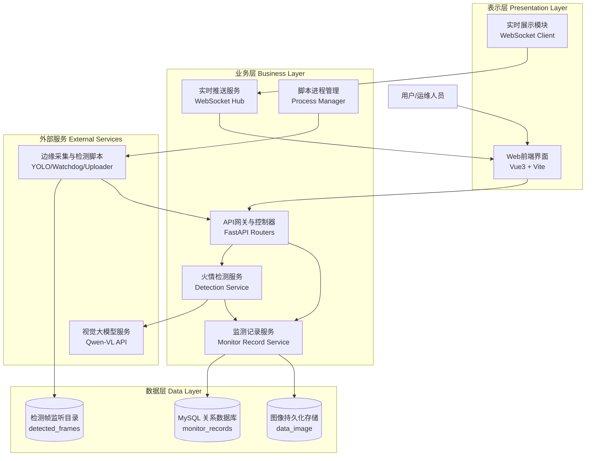

```mermaid
flowchart TB
    U[用户/运维人员]

    subgraph L1[表示层 Presentation Layer]
        FE[Web前端界面<br/>Vue3 + Vite]
        RT[实时展示模块<br/>WebSocket Client]
    end

    subgraph L2[业务层 Business Layer]
        GW[API网关与控制器<br/>FastAPI Routers]
        DET[火情检测服务<br/>Detection Service]
        MON[监测记录服务<br/>Monitor Record Service]
        PUSH[实时推送服务<br/>WebSocket Hub]
        PM[脚本进程管理<br/>Process Manager]
    end

    subgraph L3[数据层 Data Layer]
        DB[(MySQL 关系数据库<br/>monitor_records)]
        FS1[(图像持久化存储<br/>data_image)]
        FS2[(检测帧监听目录<br/>detected_frames)]
    end

    subgraph L4[外部服务 External Services]
        QWEN[视觉大模型服务<br/>Qwen-VL API]
        EDGE[边缘采集与检测脚本<br/>YOLO/Watchdog/Uploader]
    end

    U --> FE
    FE --> GW
    RT --> PUSH
    GW --> DET
    GW --> MON
    DET --> QWEN
    DET --> MON
    MON --> DB
    MON --> FS1
    PM --> EDGE
    EDGE --> FS2
    EDGE --> GW
    PUSH --> FE

```