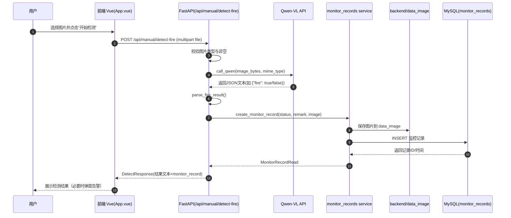

```mermaid
sequenceDiagram
    autonumber
    participant U as 用户
    participant FE as 前端 Vue(App.vue)
    participant API as FastAPI(/api/manual/detect-fire)
    participant QWEN as Qwen-VL API
    participant SVC as monitor_records service
    participant FS as backend/data_image
    participant DB as MySQL(monitor_records)

    U->>FE: 选择图片并点击“开始检测”
    FE->>API: POST /api/manual/detect-fire (multipart file)
    API->>API: 校验图片类型与非空
    API->>QWEN: call_qwen(image_bytes, mime_type)
    QWEN-->>API: 返回JSON文本(如 {"fire": true/false})
    API->>API: parse_fire_result()
    API->>SVC: create_monitor_record(status, remark, image)
    SVC->>FS: 保存图片到 data_image
    SVC->>DB: INSERT 监控记录
    DB-->>SVC: 返回记录ID/时间
    SVC-->>API: MonitorRecordRead
    API-->>FE: DetectResponse(结果文本+monitor_record)
    FE-->>U: 展示检测结果（必要时弹窗告警）

```