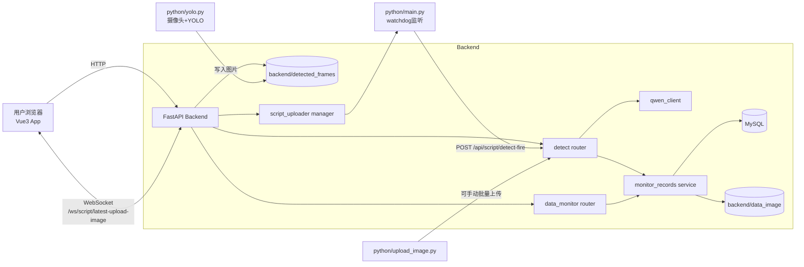

```mermaid
flowchart LR
  U[用户浏览器<br/>Vue3 App] -->|HTTP| B[FastAPI Backend]
  U <-->|WebSocket<br/>/ws/script/latest-upload-image| B

  subgraph Backend
    B --> R1[detect router]
    B --> R2[data_monitor router]
    R1 --> S1[qwen_client]
    R1 --> S2[monitor_records service]
    R2 --> S2
    S2 --> DB[(MySQL)]
    S2 --> FS2[(backend/data_image)]
    B --> FS1[(backend/detected_frames)]
    B --> PM[script_uploader manager]
  end

  PM --> P1[python/main.py<br/>watchdog监听]
  P1 -->|POST /api/script/detect-fire| R1
  Y[python/yolo.py<br/>摄像头+YOLO] -->|写入图片| FS1
  P2[python/upload_image.py] -->|可手动批量上传| R1

```