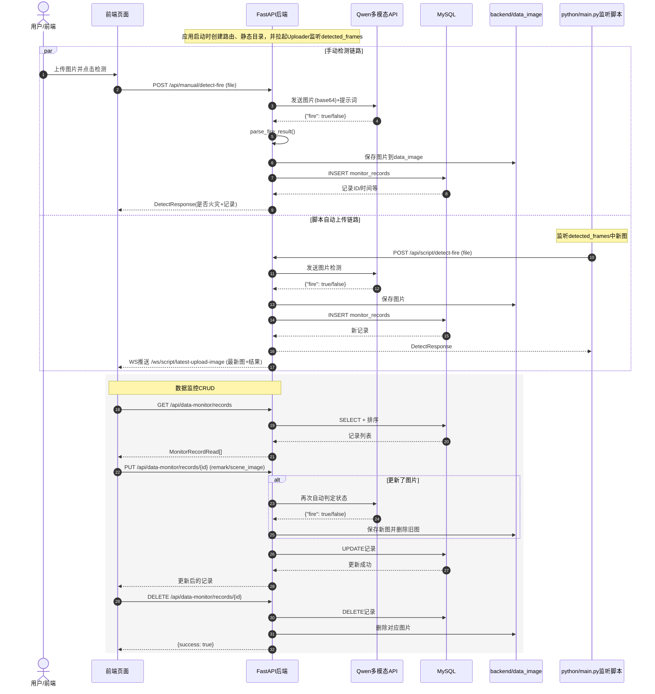

```mermaid
sequenceDiagram
    autonumber
    actor User as 用户/前端
    participant FE as 前端页面
    participant API as FastAPI后端
    participant Qwen as Qwen多模态API
    participant DB as MySQL
    participant FS as backend/data_image
    participant Uploader as python/main.py监听脚本

    Note over API: 应用启动时创建路由、静态目录，并拉起Uploader监听detected_frames

    par 手动检测链路
        User->>FE: 上传图片并点击检测
        FE->>API: POST /api/manual/detect-fire (file)
        API->>Qwen: 发送图片(base64)+提示词
        Qwen-->>API: {"fire": true/false}
        API->>API: parse_fire_result()
        API->>FS: 保存图片到data_image
        API->>DB: INSERT monitor_records
        DB-->>API: 记录ID/时间等
        API-->>FE: DetectResponse(是否火灾+记录)
    and 脚本自动上传链路
        Note over Uploader: 监听detected_frames中新图
        Uploader->>API: POST /api/script/detect-fire (file)
        API->>Qwen: 发送图片检测
        Qwen-->>API: {"fire": true/false}
        API->>FS: 保存图片
        API->>DB: INSERT monitor_records
        DB-->>API: 新记录
        API-->>Uploader: DetectResponse
        API-->>FE: WS推送 /ws/script/latest-upload-image (最新图+结果)
    end

    rect rgb(245,245,245)
    Note over FE,API: 数据监控CRUD
    FE->>API: GET /api/data-monitor/records
    API->>DB: SELECT + 排序
    DB-->>API: 记录列表
    API-->>FE: MonitorRecordRead[]

    FE->>API: PUT /api/data-monitor/records/{id} (remark/scene_image)
    alt 更新了图片
        API->>Qwen: 再次自动判定状态
        Qwen-->>API: {"fire": true/false}
        API->>FS: 保存新图并删除旧图
    end
    API->>DB: UPDATE记录
    DB-->>API: 更新成功
    API-->>FE: 更新后的记录

    FE->>API: DELETE /api/data-monitor/records/{id}
    API->>DB: DELETE记录
    API->>FS: 删除对应图片
    API-->>FE: {success: true}
    end

```